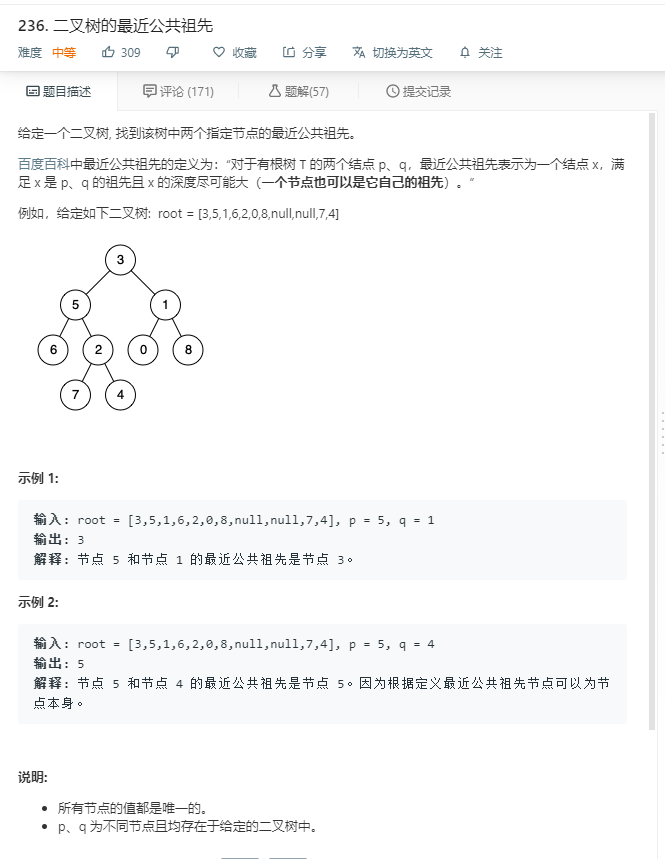
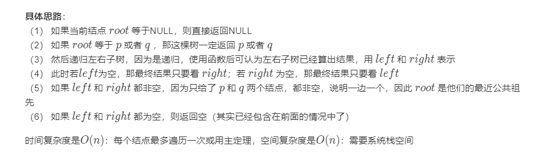

# 236.二叉树的最近公共祖先
  

```
/**
 * Definition for a binary tree node.
 * function TreeNode(val) {
 *     this.val = val;
 *     this.left = this.right = null;
 * }
 */
/**
 * @param {TreeNode} root
 * @param {TreeNode} p
 * @param {TreeNode} q
 * @return {TreeNode}
 */
var lowestCommonAncestor = function(root, p, q) {
     let tempone = [],temptwo = [],one,two,result,only=[];
    function lrm(r){
        if(!r){
            return;
        }

        lrm(r.left);
        lrm(r.right);
        tempone.push(r.val);
        only.push(r);
    }

    function mlr(r){
        if(!r){
            return;
        }

        temptwo.push(r.val);
        mlr(r.left);
        mlr(r.right);
    }

    lrm(root);
    mlr(root);

    one = Math.max(tempone.indexOf(p.val),tempone.indexOf(q.val));
    two = Math.min(temptwo.indexOf(p.val),temptwo.indexOf(q.val));

    console.log(tempone,temptwo,one,two);
    for(let i=one;i<tempone.length;i++){
        if(temptwo.indexOf(tempone[i]) <= two){
            result = i;
            break;
        }
    }

    console.log(tempone[result]);
    return only[result];
};
```

## 递归
  

```
/**
 * Definition for a binary tree node.
 * function TreeNode(val) {
 *     this.val = val;
 *     this.left = this.right = null;
 * }
 */
/**
 * @param {TreeNode} root
 * @param {TreeNode} p
 * @param {TreeNode} q
 * @return {TreeNode}
 */
var lowestCommonAncestor = function(root, p, q) {
   if(!root) {
       return null;
   }

   if(root == p || root == q) {
       return root;
   }

   let left = lowestCommonAncestor(root.left,p,q);
   let right = lowestCommonAncestor(root.right,p,q);

   if(!left) {
       return right;
   }
   if(!right) {
       return left;
   }
   if(right && left) {
       return root;
   }

   return null;
};
```

```
/**
 * Definition for a binary tree node.
 * function TreeNode(val) {
 *     this.val = val;
 *     this.left = this.right = null;
 * }
 */
/**
 * @param {TreeNode} root
 * @param {TreeNode} p
 * @param {TreeNode} q
 * @return {TreeNode}
 */
var lowestCommonAncestor = function(root, p, q) {
    if (!root || root.val === p.val || root.val === q.val) return root;

    let left = lowestCommonAncestor(root.left, p, q);
    let right = lowestCommonAncestor(root.right, p, q);

    return left === null ? right : (right === null ? left : root);
};
```