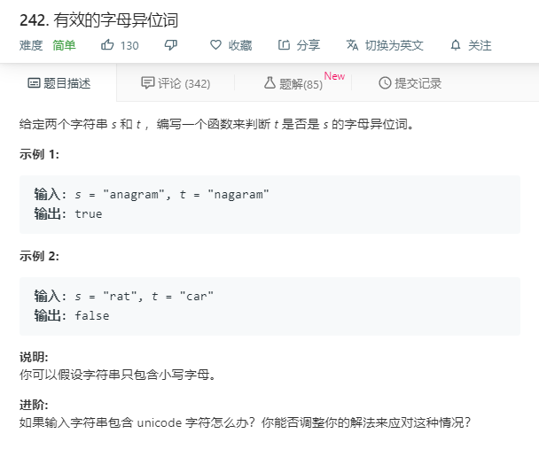

# 242.有效的字母异位词
  

```
/**
 * @param {string} s
 * @param {string} t
 * @return {boolean}
 */
var isAnagram = function(s, t) {
    let one = s.split('').sort();
    let two = t.split('').sort();
    console.log(one,two);
    if(one.length != two.length){
      return false;
    }
    let ft = 0;
    one.map((key,value)=>{
      // console.log(key,value,two[value]);
      if(key !== two[value]){
        ft = 1;
      }
    })

    if(ft == 1){
      return false;
    }
    return true;
};


```

## Map思想
```
/**
 * @param {string} s
 * @param {string} t
 * @return {boolean}
 */
var isAnagram = function(s, t) {
    let a = new Map(), b = new Map();

    const now = (who, whoMap) => {
        for (let i of who) {
            if (whoMap.has(i)) {
                whoMap.set(i, whoMap.get(i) + 1);
            } else {
                whoMap.set(i, 1);
            }
        }
    }

    now(s, a);
    now(t, b);

    console.log(a,b);

    if (a.size !== b.size) {
        return false;
    }
    for (let [key, value] of a) {
        if (value !== b.get(key)) {
            return false;
        }
    }

    return true;
};
```