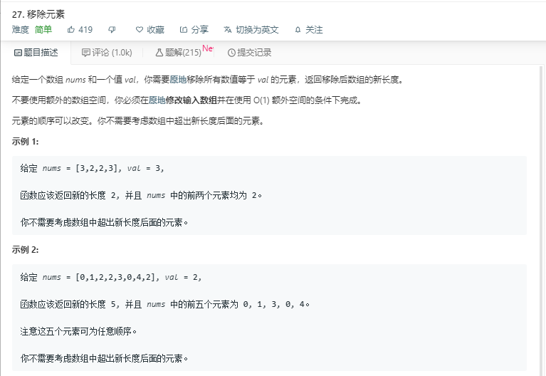

# 27.移除元素
  

```
/**
 * @param {number[]} nums
 * @param {number} val
 * @return {number}
 */
var removeElement = function(nums, val) {
    for(let i=0;i<nums.length;i++){
        if(nums[i]==val){
            nums.splice(i,1);
            i--;
        }
    }
};
```