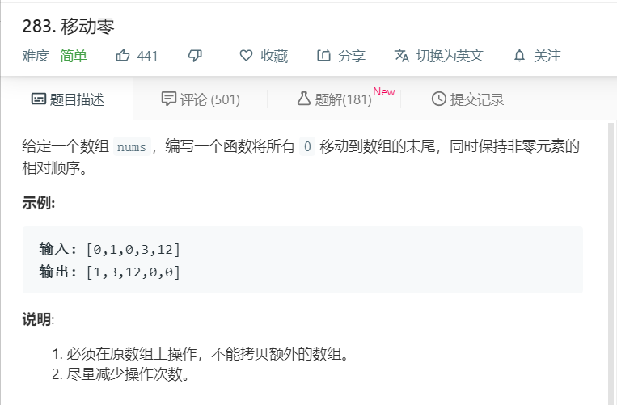

# 283.移动零


```
/**
 * @param {number[]} nums
 * @return {void} Do not return anything, modify nums in-place instead.
 */
var moveZeroes = function(nums) {
    let temp = nums.length;
    for(let i=0;i<temp;i++){
        if(nums[i] == 0){
            nums.splice(i,1);
            i--;
        }
    }
    let num = temp - nums.length;
    for(let i = 0;i<num;i++){
      nums.push(0);
    }
    // console.log(nums);
};
```