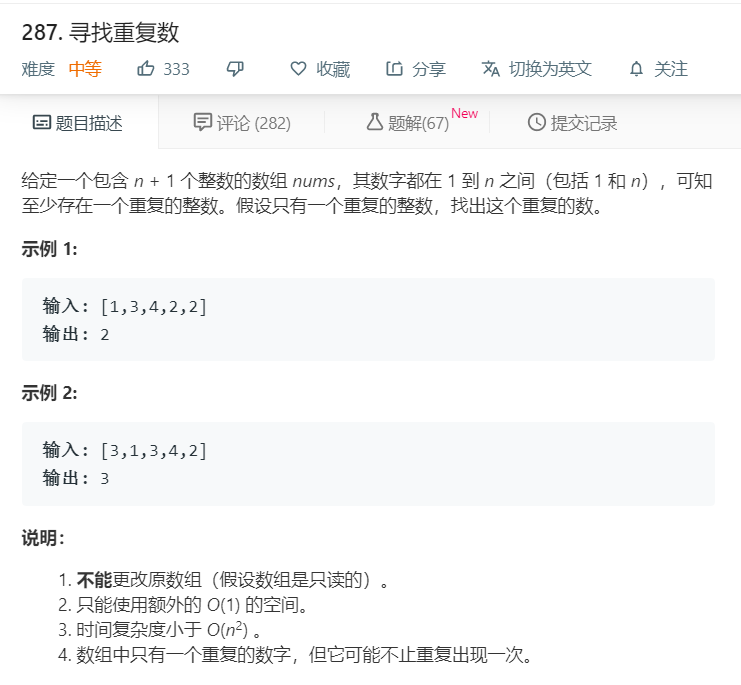

# 287.寻找重复数
  

```
/**
 * @param {number[]} nums
 * @return {number}
 */
var findDuplicate = function(nums) {
    for(let i=0;i<nums.length;i++){
        if(nums.lastIndexOf(nums[i]) != nums.indexOf(nums[i])){
            return nums[i];
        }
    }
};
```

```
var findDuplicate = function(nums) {
    let temp = nums.slice(0);
    temp.sort((a,b)=>a-b);
    for(let i=0;i<temp.length-1;i++){
        if(temp[i] == temp[i+1]){
            return temp[i];
        }
    }
};
```

```
/**
 * @param {number[]} nums
 * @return {number}
 */
var findDuplicate = function(nums) {
    let start = 0,end = 1;
    while(nums[start] != nums[end]) {
        if(start + 1 == nums.length) {
            start = 0;
        }else {
            start++;
        }
        if(end + 2 == nums.length) {
            end = 0;
        }else {
            end++;
        }
    }

    return nums[start];
};
```