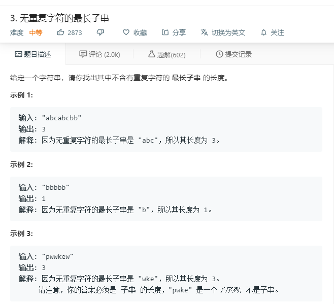

# 3.无重复字符的最长子串
  

```
/**
 * @param {string} s
 * @return {number}
 */
var lengthOfLongestSubstring = function(s) {
    if(s.length == 0){
        return 0;
    }
    
    let temp = [],result=[],two=[];
    for(let i=0;i<s.length;i++){
        // console.log(i,two);
        two.push(s[i]);
        // console.log(i,two);
        if(temp.length == 0 || temp.indexOf(s[i]) < 0){
            temp.push(s[i]);
            if(i == s.length-1){
                // console.log(temp);
                result.push(temp.length);
            }
            
        }else{
            // console.log(temp);
            result.push(temp.length);
            temp = [];
            // console.log(two);
            i = two.lastIndexOf(s[i],-2);
            two = s.split('').slice(0,i+1);
            // console.log(i,s[i]);
        }
    }
    console.log(result);
    return Math.max(...result);
};
```