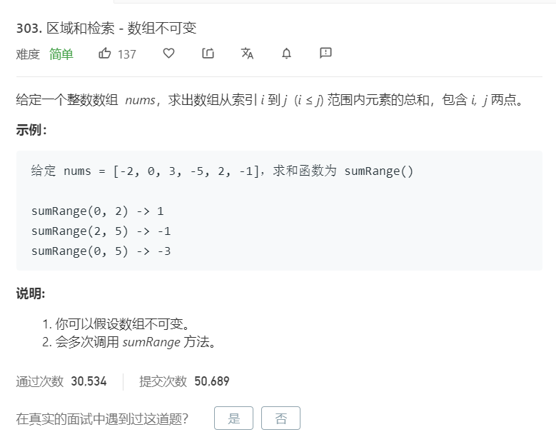

# 303.区域和检索-数组不可变
  

```
/**
 * @param {number[]} nums
 */
var NumArray = function(nums) {
    this.temp = [nums[0]];
    for(let i=1;i<nums.length;i++){
        let now = this.temp[this.temp.length-1] + nums[i];
        this.temp.push(now);
    }
};

/** 
 * @param {number} i 
 * @param {number} j
 * @return {number}
 */
NumArray.prototype.sumRange = function(i, j) {
    if(i == 0){
        return this.temp[j];
    }else{
        return this.temp[j] - this.temp[i-1];
    }
};

/**
 * Your NumArray object will be instantiated and called as such:
 * var obj = new NumArray(nums)
 * var param_1 = obj.sumRange(i,j)
 */
```