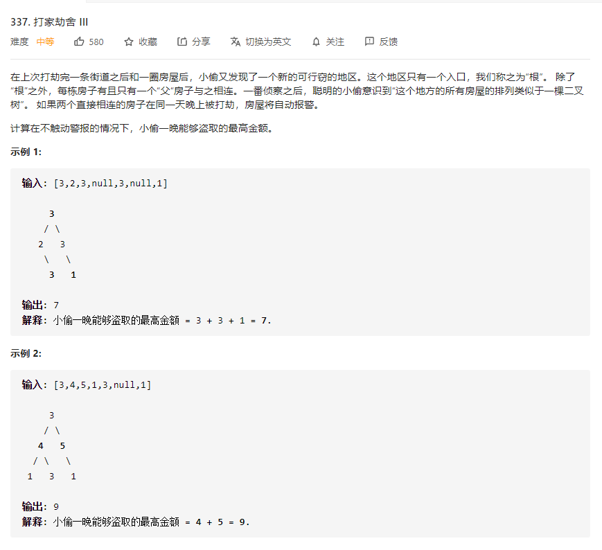

# 337.打家劫舍III
  

## 递归
```
/**
 * Definition for a binary tree node.
 * function TreeNode(val) {
 *     this.val = val;
 *     this.left = this.right = null;
 * }
 */
/**
 * @param {TreeNode} root
 * @return {number}
 */
var rob = function(root) {
   if (!root) {
       return 0;
   }

   let hadRoot = root.val;

   if(root.left) {
       hadRoot += rob(root.left.left) + rob(root.left.right);
   }

   if(root.right) {
       hadRoot += rob(root.right.left) + rob(root.right.right);
   }

   const robExcludeRoot = rob(root.left) + rob(root.right);

   return Math.max(hadRoot, robExcludeRoot);
};
```

## 记忆化递归
```
/**
 * Definition for a binary tree node.
 * function TreeNode(val) {
 *     this.val = val;
 *     this.left = this.right = null;
 * }
 */
/**
 * @param {TreeNode} root
 * @return {number}
 */
var rob = function(root) {
    let map = new Map();

   let sencond = (root) => {
    if (!root) {
        return 0;
    }
    if (map.has(root)) {
        return map.get(root);
    }

    let hadRoot = root.val;

    if(root.left) {
        hadRoot += sencond(root.left.left) + sencond(root.left.right);
    }

    if(root.right) {
        hadRoot += sencond(root.right.left) + sencond(root.right.right);
    }

    const robExcludeRoot = sencond(root.left) + sencond(root.right);

    let res = Math.max(hadRoot, robExcludeRoot);
    map.set(root, res)
    return res;
   }

   let res = sencond(root);
   return res;
};
```

## 动态规划
```
/**
 * Definition for a binary tree node.
 * function TreeNode(val) {
 *     this.val = val;
 *     this.left = this.right = null;
 * }
 */
/**
 * @param {TreeNode} root
 * @return {number}
 */
var rob = function(root) {
    const mid = (r) => {
        if (!r) {
            return [0, 0];
        }

        let left = mid(r.left);
        let right = mid(r.right);

        let noFather = Math.max(left[0], left[1]) + Math.max(right[0], right[1]);
        let hadFather = r.val + left[0] + right[0];

        return [noFather, hadFather];
    }

    let res = mid(root);

    return Math.max(res[0], res[1]);
};
```