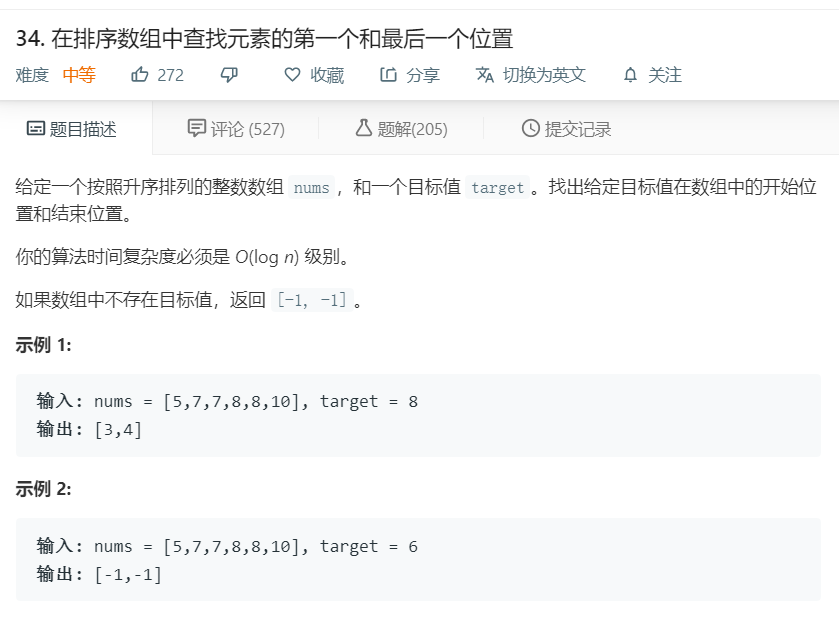

# 34.在排序数组中查找元素的第一个和最后一个位置
  

```
/**
 * @param {number[]} nums
 * @param {number} target
 * @return {number[]}
 */
var searchRange = function(nums, target) {
    let one = nums.indexOf(target);
    let two = nums.lastIndexOf(target);
    return [one,two];
};
```