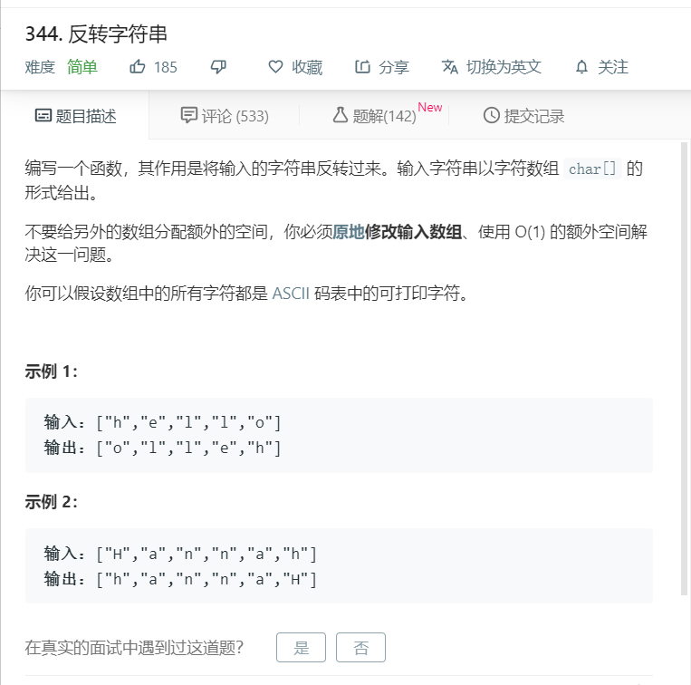

# 344.反转字符串
  

```
/**
 * @param {character[]} s
 * @return {void} Do not return anything, modify s in-place instead.
 */
var reverseString = function(s) {
    return s.reverse();
};
```

```
var reverseString = function(s) {
  let num = s.length >> 1;
  for(let i=0;i<num;i++){
    [s[i],s[s.length-i-1]] = [s[s.length-i-1],s[i]];
  }
//   console.log(s);
  return s;
};
```