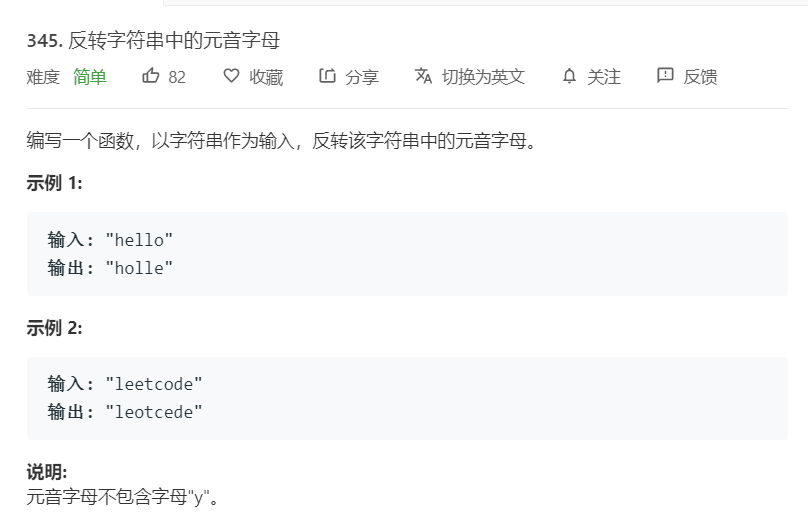

# 345.反转字符串中的元音字母
  

```
/**
 * @param {string} s
 * @return {string}
 */
var reverseVowels = function(s) {
    let mate = ['a', 'e', 'i', 'o', 'u', 'A', 'E', 'I', 'O', 'U'];
    let temp = s.split('');
    let result = [];

    for(let i=0;i<temp.length;i++){
        if(mate.indexOf(temp[i]) > -1){
            result.push(temp[i]);
            temp[i] = '';
        }
    }

    result.reverse();

    for(let i=0;i<temp.length;i++){
        if(temp[i].length == 0){
            temp[i] = result.splice(0,1);
        }
    }

    return temp.join('')
};
```