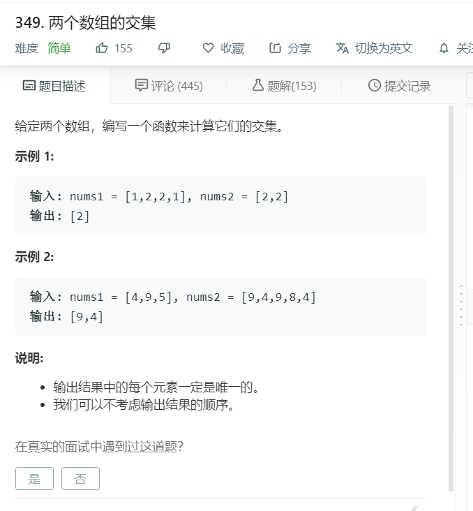

# 349.两个数组的交集
  

```
/**
 * @param {number[]} nums1
 * @param {number[]} nums2
 * @return {number[]}
 */
var intersection = function(nums1, nums2) {
    let one = [...new Set(nums1)];
    let two = [...new Set(nums2)];
    console.log(one,two);
    let result = [];
    for(let i=0;i<one.length;i++){
        if(two.indexOf(one[i])>=0){
            result.push(one[i])
        }
    }
    return result;

};
```