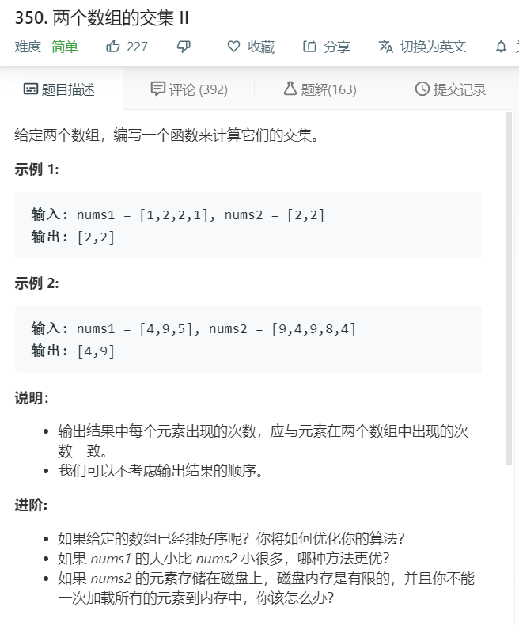

# 350.两个数组的交集II
  

```
/**
 * @param {number[]} nums1
 * @param {number[]} nums2
 * @return {number[]}
 */
var intersect = function(nums1, nums2) {
    let temp = [];
    for(let i=0;i<nums1.length;i++){
        let now = nums2.indexOf(nums1[i]);
        if(now >= 0){
            temp.push(nums1[i]);
            nums2.splice(now,1);
        }
    }
    console.log(temp);
    return temp;
};
```