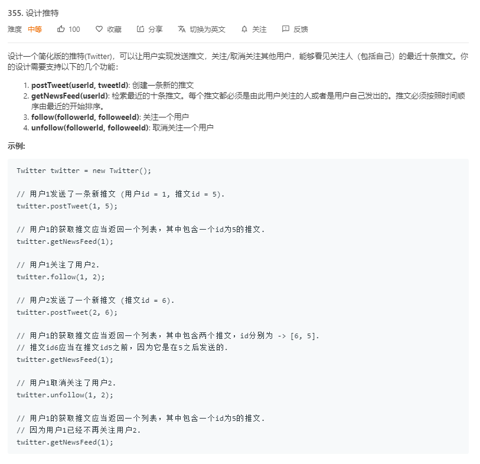

# 355.设计推特
  

```
/**
 * Initialize your data structure here.
 */
var Twitter = function() {
    this.alltwitter = [];
    this.user = {};
};

/**
 * Compose a new tweet. 
 * @param {number} userId 
 * @param {number} tweetId
 * @return {void}
 */
Twitter.prototype.postTweet = function(userId, tweetId) {
    this.alltwitter.push(userId + '*' + tweetId);
    if(!this.user[userId]){
        this.user[userId] = new Array();
    }
    // console.log(this.alltwitter)
};

/**
 * Retrieve the 10 most recent tweet ids in the user's news feed. Each item in the news feed must be posted by users who the user followed or by the user herself. Tweets must be ordered from most recent to least recent. 
 * @param {number} userId
 * @return {number[]}
 */
Twitter.prototype.getNewsFeed = function(userId) {
    let temp = [];
    if(!this.user[userId]){
        this.user[userId] = new Array();
    }
    for(let i=this.alltwitter.length-1;i>-1;i--){
        let now = this.alltwitter[i].split('*');
        if(now[0] == userId || this.user[userId].indexOf(+now[0]) > -1){
            temp.push(now[1]);
        }
        if(temp.length == 10){
            return temp;
        }
    }

    return temp;
};

/**
 * Follower follows a followee. If the operation is invalid, it should be a no-op. 
 * @param {number} followerId 
 * @param {number} followeeId
 * @return {void}
 */
Twitter.prototype.follow = function(followerId, followeeId) {
    if(!this.user[followerId]){
        this.user[followerId] = new Array();
    }
    if(this.user[followerId].indexOf(followeeId) < 0){
        this.user[followerId].push(followeeId);
    }
    // console.log(this.user)
};

/**
 * Follower unfollows a followee. If the operation is invalid, it should be a no-op. 
 * @param {number} followerId 
 * @param {number} followeeId
 * @return {void}
 */
Twitter.prototype.unfollow = function(followerId, followeeId) {
    if(!this.user[followerId]){
        this.user[followerId] = new Array();
    }
    if(this.user[followerId].indexOf(followeeId) > -1){
        let temp = this.user[followerId].indexOf(followeeId);
        this.user[followerId].splice(temp,1);
    }

    // console.log(this.user)
};

/**
 * Your Twitter object will be instantiated and called as such:
 * var obj = new Twitter()
 * obj.postTweet(userId,tweetId)
 * var param_2 = obj.getNewsFeed(userId)
 * obj.follow(followerId,followeeId)
 * obj.unfollow(followerId,followeeId)
 */
```