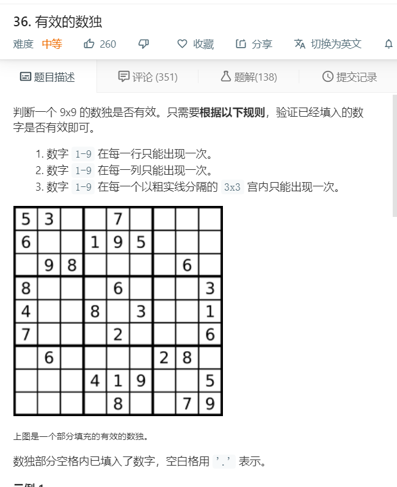
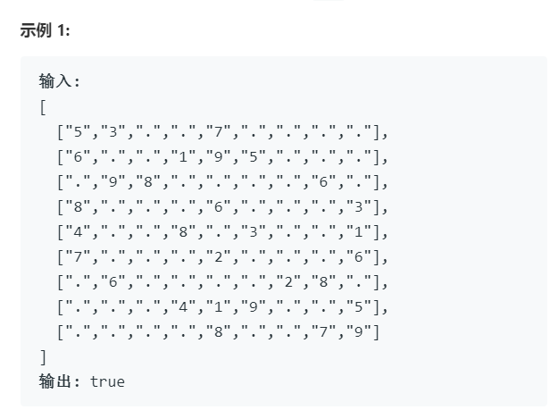
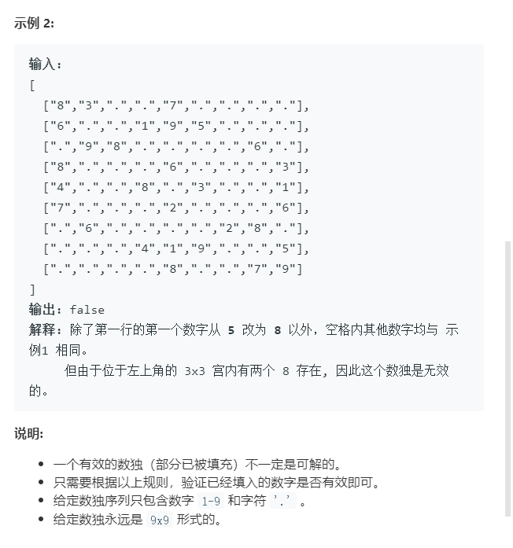

# 36.有效的数独
  

  

  

```
/**
 * @param {character[][]} board
 * @return {boolean}
 */
var isValidSudoku = function(board) {
    let one=0,two=0;
    for(let i=0;i<9;i++){
        for(let j=0;j<9;j++){
            if(board[i][j] != '.' && board[i].indexOf(board[i][j]) != board[i].lastIndexOf(board[i][j])){
                console.log(i,j)
                return false;
            }
        }
    }

    for(let i=0;i<9;i++){
        let temp = [];
        for(let j=0;j<9;j++){
            temp.push(board[j][i]);
        }
        console.log(temp);
        for(let e=0;e<9;e++){
            if(temp[e]!= '.' && temp.indexOf(temp[e]) != temp.lastIndexOf(temp[e])){
                return false;
            }
        }
    }

    while(one<9 && two <9){
        let temp = [];
        for(let i=0;i<3;i++){
            for(let j=0;j<3;j++){
                if(board[one+i][two+j] != '.'){
                    temp.push(board[one+i][two+j]);
                }
            }
        }

        
        for(let i=0;i<temp.length;i++){
            if(temp.indexOf(temp[i]) != temp.lastIndexOf(temp[i])){
                console.log(temp);
                return false;
            }
        }
        if(one+3 < 9){
            one += 3;
        }else{
            one = 0;
            two += 3;
        }
    }

    console.log(1);
    return true;
};

```