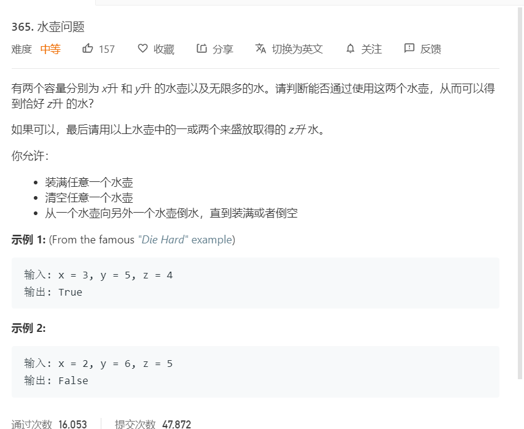

# 365.水壶问题
   


```
/**
 * @param {number} x
 * @param {number} y
 * @param {number} z
 * @return {boolean}
 */
var canMeasureWater = function(x, y, z) {
    let stack = [[0,0]];
    let self = new Set();
    
    while(stack.length > 0){
        let temp = stack.pop();
        let rx = temp[0],ry = temp[1];
        if(rx == z || ry == z || ry + rx == z){
            return true;
        }
        let now = rx + 'a' + ry;
        if(self.has(now)){
            continue;
        }
        
        self.add(rx + 'a' + ry);
        //把 X 壶灌满
        stack.push([x,ry]);
        // 把 Y 壶灌满。
        stack.push([rx,y]);
        //把 X 壶倒空。
        stack.push([0,ry]);
        //把 Y 壶倒空。
        stack.push([rx,0]);
        //把 X 壶的水灌进 Y 壶，直至灌满或倒空
        stack.push([rx-Math.min(rx,y-ry),ry+Math.min(rx,y-ry)]);
        //把 Y 壶的水灌进 X 壶，直至灌满或倒空。
        stack.push([rx+Math.min(ry,x-rx),ry-Math.min(ry,x-rx)]);
    }

    return false;
};
```