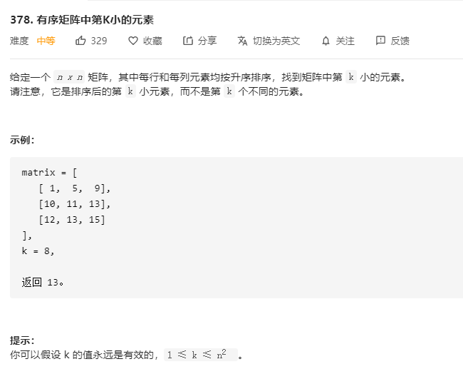

# 378.有序矩阵中第k小的元素
  

```
/**
 * @param {number[][]} matrix
 * @param {number} k
 * @return {number}
 */
var kthSmallest = function(matrix, k) {
    let temp = [];

    while(temp.length < k) {
        let min = Infinity;
        let who = 0;

        for(let i = 0;i<matrix.length;i++) {
            if(min > matrix[i][0]){
                min = matrix[i][0];
                who = i;
            }
        }

        temp.push(matrix[who].shift());
    }

    console.log(temp);
    return temp.pop();
};
```