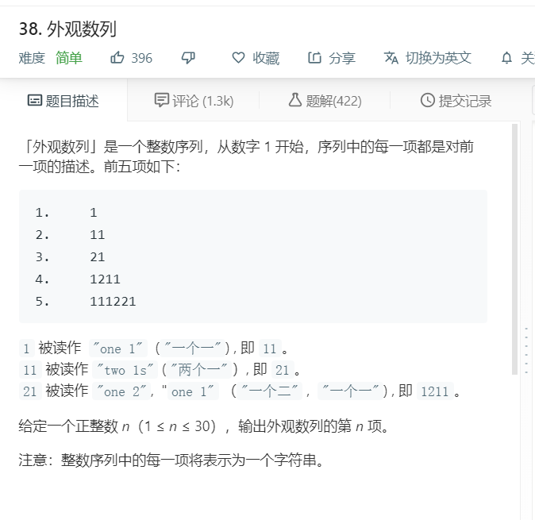
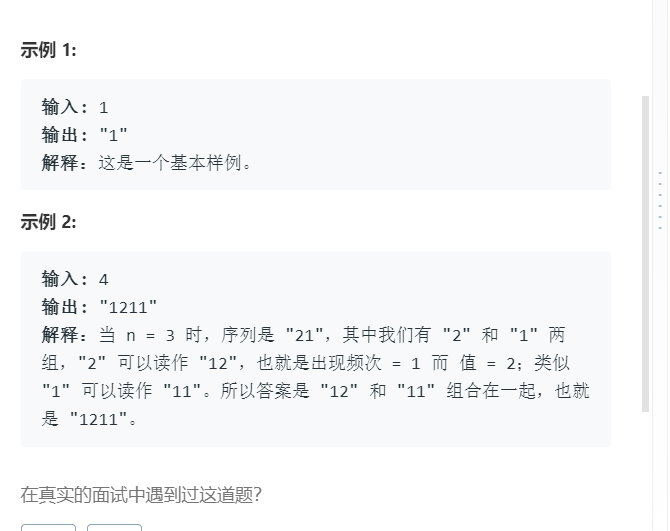

# 38.外观数列
    

  

```
/**
 * @param {number} n
 * @return {string}
 */

//用语文的数量词和名词的思想去理解就很容易了，
//下一行的数字是用来描述上一行的，上一行有11，那么下一行对应就是2个1，即21。 数量词为2，名词为1
var countAndSay = function(n) {
    let result = null;
    let one = (now,end) => {
        if(end == n){
            result = now;
            return;
        }

        let temp = now.toString().split('');
        console.log(temp)
        let list = [],two=[];
        for(let i = 0;i<temp.length;i++){
            if(two.length == 0 || two[two.length-1] == +temp[i]){
                two.push(+temp[i]);
                if(i == temp.length-1){
                    list.push(two.length);
                    list.push(two[0]);
                    console.log(list)
                }
            }else{
                list.push(two.length);
                list.push(two[0]);
                two = [];
                two.push(+temp[i]);
                if(i == temp.length-1){
                    list.push(two.length);
                    list.push(two[0]);
                    console.log(list)
                }
                console.log(list)
            }
        }
        // console.log(list.join(''))
        one(list.join(''),end+1);
    }

    one(1,1);
    return result.toString();
};
```