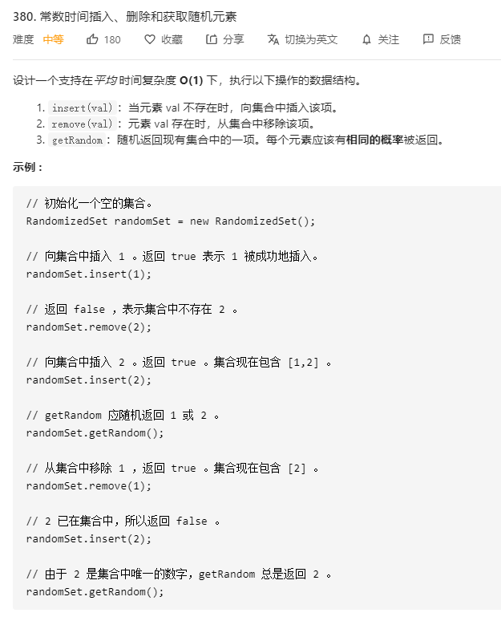

# 380.常数时间插入删除和获取随机元素
  

```
/**
 * Initialize your data structure here.
 */
var RandomizedSet = function() {
    this.temp = new Set();
};

/**
 * Inserts a value to the set. Returns true if the set did not already contain the specified element. 
 * @param {number} val
 * @return {boolean}
 */
RandomizedSet.prototype.insert = function(val) {
    if (!this.temp.has(val)) {
        this.temp.add(val);
        return true;
    } else {
        return false;
    }
};

/**
 * Removes a value from the set. Returns true if the set contained the specified element. 
 * @param {number} val
 * @return {boolean}
 */
RandomizedSet.prototype.remove = function(val) {
    if(this.temp.has(val)) {
        this.temp.delete(val);
        return true;
    } else {
        return false;
    }
};

/**
 * Get a random element from the set.
 * @return {number}
 */
RandomizedSet.prototype.getRandom = function() {
    let who = parseInt(Math.random()*(this.temp.size));
    return [...this.temp][who];
};

/**
 * Your RandomizedSet object will be instantiated and called as such:
 * var obj = new RandomizedSet()
 * var param_1 = obj.insert(val)
 * var param_2 = obj.remove(val)
 * var param_3 = obj.getRandom()
 */
```