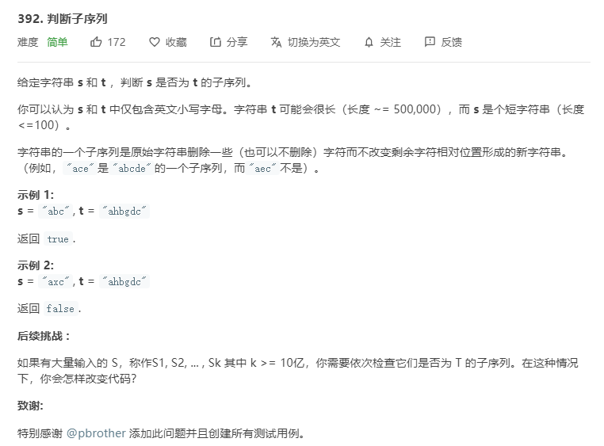

# 392.判断子序列
  

```
/**
 * @param {string} s
 * @param {string} t
 * @return {boolean}
 */
var isSubsequence = function(s, t) {
    s = s.split('');
    if(s.length == 0) {
        return true;
    }
    t = t.split('');

    let result = s.length;
    let min = 0;

    for(let i = min;i<t.length;i++) {
        let now = s.shift();
        if(t.indexOf(now) > -1){
            result--;
            t = t.slice(t.indexOf(now) + 1);
            console.log(t);
            min = 0;
            i=-1;
        }
    }

    console.log(result);

    if(result == 0) {
        return true;
    }else {
        return false;
    }
};
```