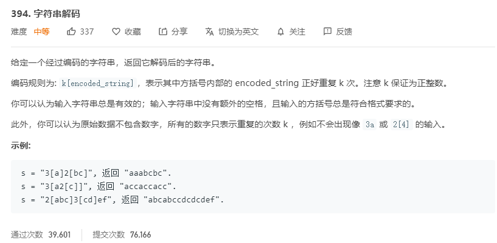

# 394.字符串解码
  

```
/**
 * @param {string} s
 * @return {string}
 */
var decodeString = function(s) {
    s = s.split('');
    let temp = [], result = [];

    s.map((el) => {
        if(temp.length == 0 || el !== ']') {
            temp.push(el);
        }else {
            let left = temp.lastIndexOf('[');
            let now = temp.splice(left+1);
            temp.pop();
            let num = [];
            while(!/[a-zA-Z]/.test(temp[temp.length-1]) && temp[temp.length - 1] !== '[') {
                num.push(temp.pop());
            }
            num = +(num.reverse().join(''));
            let ss = now.join('').repeat(num);
            temp.push(ss);
        }
    })

    return temp.join('');
};
```