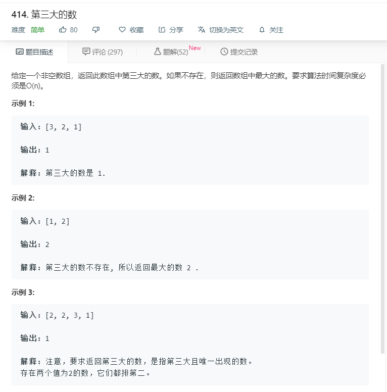

# 414.第三大的数
  

```
/**
 * @param {number[]} nums
 * @return {number}
 */
var thirdMax = function(nums) {
  let temp = [...new Set(nums)];
  temp.sort((a,b)=>b-a);
  console.log(temp[2]);
  if(temp.length>=3){
      return temp[2];
  }else{
      return temp[0];
  }
};
```