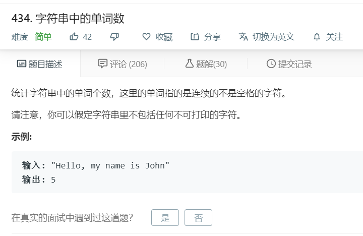

# 434.字符串中的单词数
  

```
/**
 * @param {string} s
 * @return {number}
 */
var countSegments = function(s) {
    s = s.trim();
    if(s.length == 0){
        return 0;
    }
    let temp = s.split(' ');
    for(let i = 0;i<temp.length;i++){
        if(temp[i].length == 0){
            temp.splice(i,1);
            i--;
        }
    }
    console.log(temp.length);
    return temp.length;
};
```