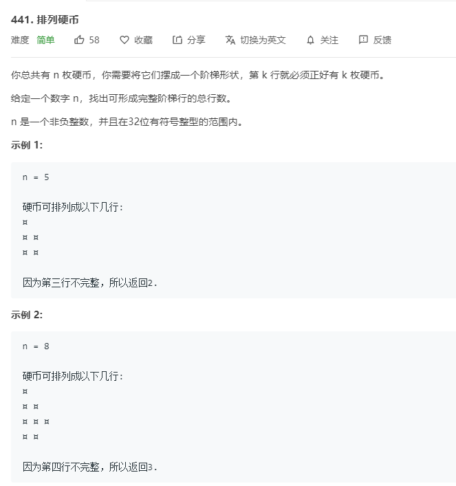

# 441.排列硬币
  

```
/**
 * @param {number} n
 * @return {number}
 */
var arrangeCoins = function(n) {
    if(n <= 1) {
        return n;
    }
    let temp = n;
    for(let i = 1;i<=n;i++) {
        temp -= i;
        if(temp < 0){
            return i-1;
        }
    }
};
```