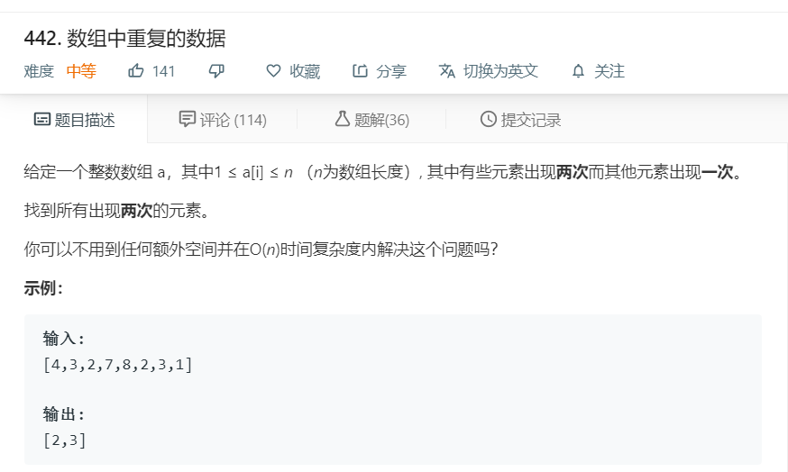

# 442.数组中重复的数据
  

```
/**
 * @param {number[]} nums
 * @return {number[]}
 */
var findDuplicates = function(nums) {
    let temp = [];
    for(let i=0;i<nums.length;i++){
        if(nums.indexOf(nums[i]) != nums.lastIndexOf(nums[i]) && temp.indexOf(nums[i])<0){
            temp.push(nums[i]);
        }
    }

    return temp;
};
```