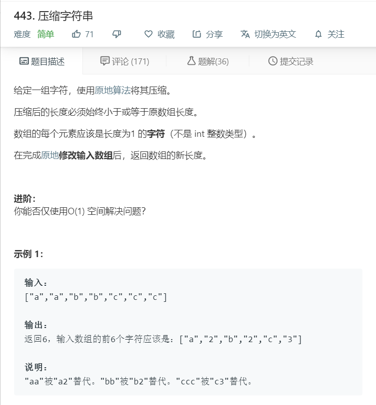
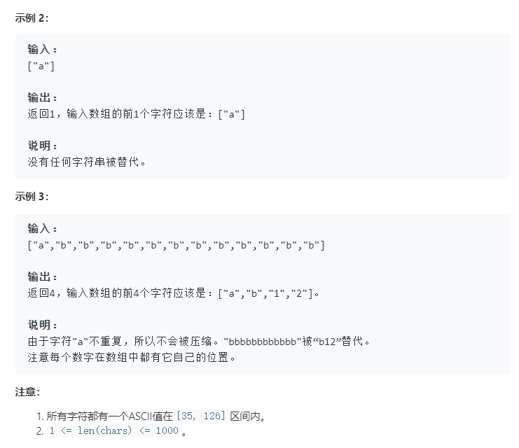

# 443.压缩字符串
  

  

```
/**
 * @param {character[]} chars
 * @return {number}
 */
var compress = function(chars) {
  if(chars.length > 1){
    let temp = [],result=[];
    for(let i=0;i<chars.length;i++){
      if(temp.length == 0 || temp[0]==chars[i]){
        temp.push(chars[i]);
        if(i == chars.length-1){
          if(temp.length == 1){
            result.push(temp[0]);
          }else{
            result.push(temp[0],temp.length);
          }
        }
      }
      else{
        if(temp.length == 1){
          result.push(temp[0]);
        }else{
          result.push(temp[0],temp.length);
        }
        temp = [];
        i--;
      }
    }
    let results = result.join('').split('');
    // console.log(results);
    for(let i=0;i<results.length;i++){
      chars[i] = results[i];
    }
    if(chars.length>results.length){
      chars.splice(results.length,chars.length-results.length);
    }
    // console.log(chars);
  }

  
};
```