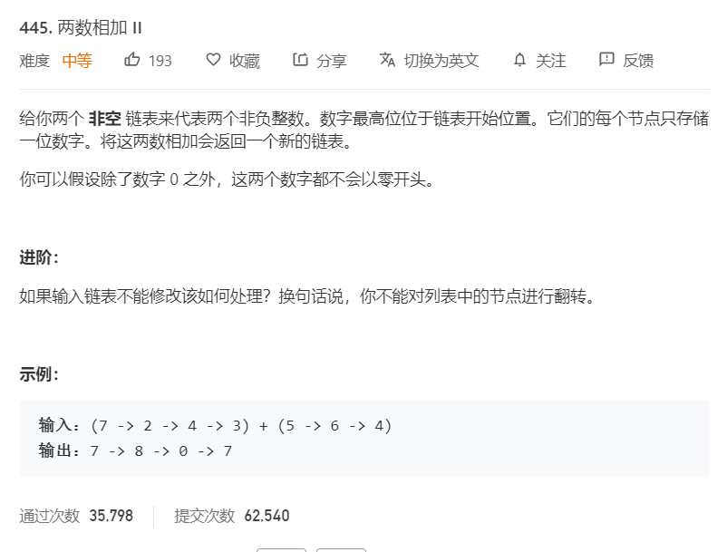

# 445.两数相加II
  

```
/**
 * Definition for singly-linked list.
 * function ListNode(val) {
 *     this.val = val;
 *     this.next = null;
 * }
 */
/**
 * @param {ListNode} l1
 * @param {ListNode} l2
 * @return {ListNode}
 */
var addTwoNumbers = function(l1, l2) {
    let one = [],two = [];
    let forget = (who,whotemp) => {
        while(who){
            whotemp.push(who);
            who = who.next;
        }
    }

    forget(l1,one);
    forget(l2,two);

    // console.log(one,two);
    let onelength = one.length-1,twolength = two.length-1,mid = 0;
    while(onelength >= 0 && twolength >= 0){
        let now = one[onelength].val + two[twolength].val;
        if(onelength > twolength){  
            one[onelength].val = now + mid;
        }else{
            two[twolength].val = now + mid;
        }
        if(now > 9){
            one[onelength].val -= 10;
            two[twolength].val -= 10;
            mid = 1;
        }else{
            mid = 0;
        }
        onelength--;
        twolength--;
    }

    if(mid == 1){
        
    }
    console.log(one);
    if(onelength > twolength){
        return one[0];
    }else{
        return two[0];
    }
};
```