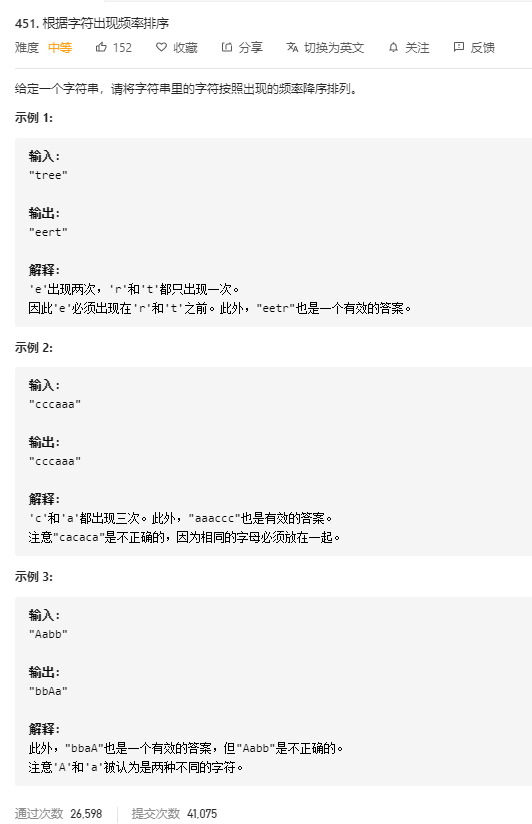

# 451.根据字符出现频率排序
  

```
/**
 * @param {string} s
 * @return {string}
 */
var frequencySort = function(s) {
    let map = new Map(), only = [...new Set(s)];

    for(let i=0;i<s.length;i++) {
        if(map.has(s[i])) {
            map.set(s[i], map.get(s[i]) + 1);
        } else {
            map.set(s[i], 1);
        }
    }

    only.sort((a,b) => map.get(b) - map.get(a))

    let res = '';

    only.map((el) => {
        res += (el.repeat(map.get(el)))
    })

    console.log(res)

    return res;
};
```