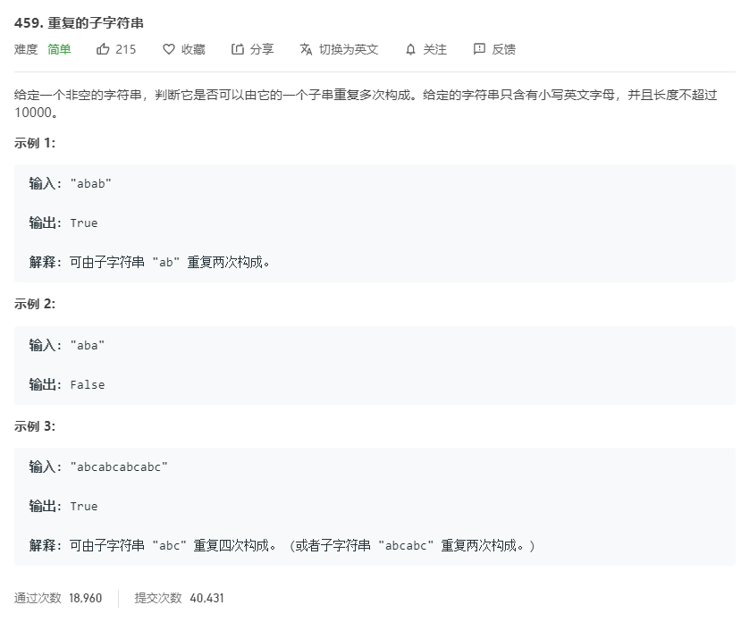

# 459.重复的子字符串
  

```
/**
 * @param {string} s
 * @return {boolean}
 */
var repeatedSubstringPattern = function(s) {
    let temps = s.split('');
    let result = [];
    let mid = temps.length >> 1;

    console.log(mid);

    for(let i=0;i<mid;i++) {
        result.push(temps[i]);
        let now = result.join('');
        let nows = s;
        let results = nows.split(now);
        if(results.join('').length == 0) {
            return true;
        }
    }

    return false;
};
```

```
/**
 * @param {string} s
 * @return {boolean}
 */
var repeatedSubstringPattern = function(s) {
    return (s + s).indexOf(s,1) != s.length
};
```