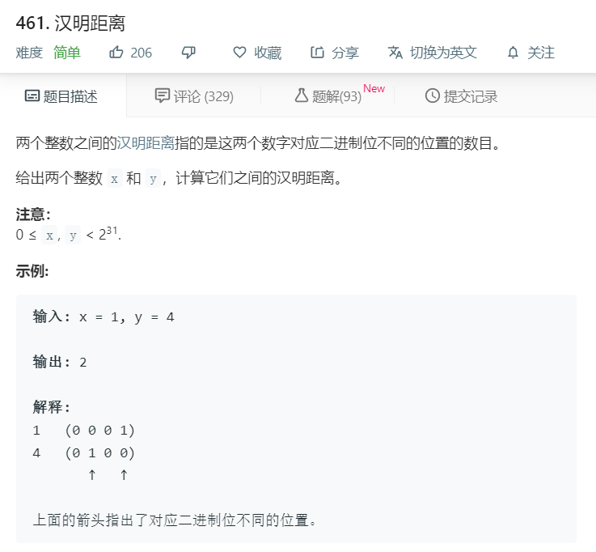

# 461.汉明距离
  

```
/**
 * @param {number} x
 * @param {number} y
 * @return {number}
 */
var hammingDistance = function(x, y) {
    let one = x.toString(2);
    let two = y.toString(2);
    let num = Math.max(one.length,two.length);
    one = one.toString().split('').reverse();
    two = two.toString().split('').reverse();
    
    let result = 0;
    for(let i=0;i<num;i++){
        if(!one[i]){
        one[i] = 0;
      }
      if(!two[i]){
        two[i] = 0;
      }
      if(parseInt(one[i]) != parseInt(two[i])){
        result += 1;
      }
    }

    // console.log(result);
    return result;
};
```