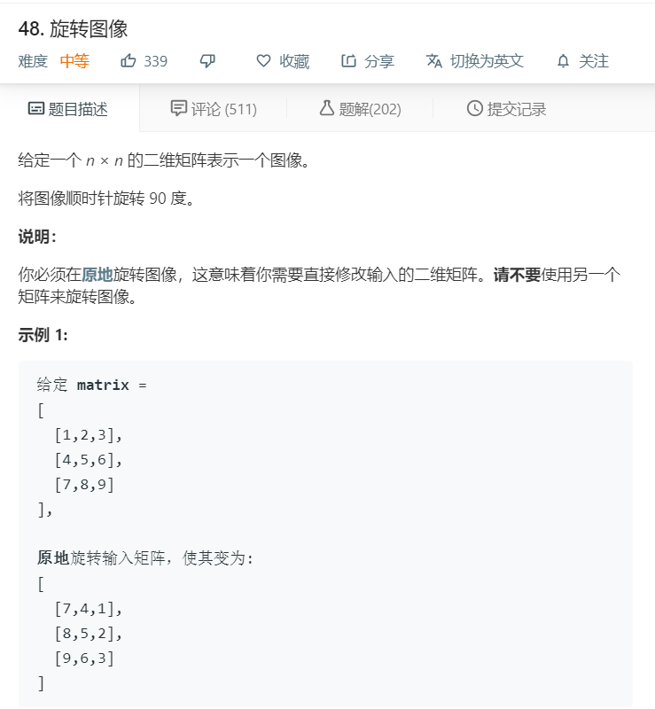
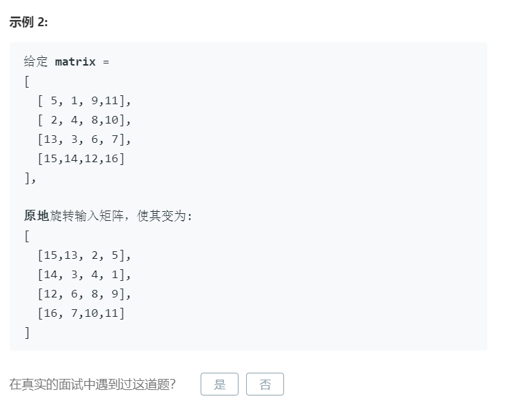

# 48.旋转图像
  

  

```
/**
 * @param {number[][]} matrix
 * @return {void} Do not return anything, modify matrix in-place instead.
 */
var rotate = function(matrix) {
    let temp = [];
    for(let i=0;i<matrix.length;i++){
        let one = matrix[i].slice(0);
        temp.push(one);
    }

    
    let len = matrix[0].length;

    for(let i=0;i<len;i++){
        for(let j=0;j<len;j++){
            matrix[i][j] = temp[len-1-j][i];
            console.log([i,j],[len-1-j,i],temp[len-1-j][i])
        }
    }

    return matrix;
};
```