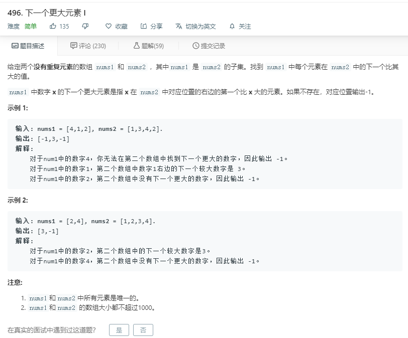

# 496.下一个更大的元素I
  

```
/**
 * @param {number[]} nums1
 * @param {number[]} nums2
 * @return {number[]}
 */
var nextGreaterElement = function(nums1, nums2) {
    let temp = [];
    nums1.forEach((el,index)=>{
        let now = nums2.indexOf(el)+1;
        if(now > nums2.length-1){
            temp.push(-1);
        }
        for(let i=now;i<nums2.length;i++){
            if(nums2[i]>el){
                temp.push(nums2[i]);
                break;
            }
            if(i == nums2.length-1 && nums2[i]<el){
                temp.push(-1);
            }
        }
    })
    return temp;
};
```