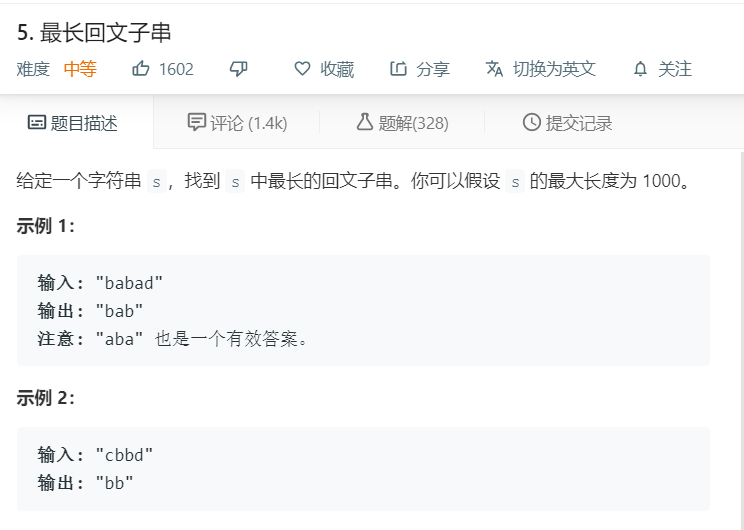

# 5.最长回文子串
  

```
/**
 * @param {string} s
 * @return {string}
 */
var longestPalindrome = function(s) {
    if(s.length <= 1){
        return s;
    }
    let temp = s.split('');
    let result = [];
    for(let i=0;i<temp.length;i++){
        let start = i-1,end=i+1;
        while(temp[start] == temp[end]){
            start--;
            end++;
            if(start < 0 || end > temp.length-1){
                break;
            }
        }
        result.push(temp.slice(start+1,end).join(''))
    }
    console.log(result);
    for(let i=0;i<temp.length-1;i++){
        let start = i,end=i+1;
        while(temp[start] == temp[end]){
            start--;
            end++;
            if(start < 0 || end > temp.length-1){
                break;
            }
        }
        if(start != i){
            result.push(temp.slice(start+1,end).join(''))
        }
    }
    console.log(result);
    let max = temp[0];
    result.forEach((el)=>{
        if(el.length > max.length){
            max = el;
        }
    })
    console.log(max);
    return max;
};
```

### 中心扩散
```
/**
 * @param {string} s
 * @return {string}
 */
var longestPalindrome = function(s) {
    let res = [];
    const mid = (begin, end, now) => {
        if (begin-1 > -1 && end+1 < s.length && s[begin-1] === s[end+1]) {
            let now = s.substring(begin-1, end+2);
            mid(begin-1, end+1, now);
        } else {
            res.push(now);
            return ;
        }
    }

    for (let i=0;i<s.length;i++) {
        res.push(s[i]);
        if (s[i+1] === s[i]) {
            let now = s[i] + s[i+1];
            mid(i, i+1, now);
        }

        if (i-1 > -1 && i+1 < s.length && s[i-1] === s[i+1]) {
            let now = s.substring(i-1, i+2);
            // console.log(now)
            mid(i-1, i+1, now);
        }
    }

    console.log(res);
    let really = '', max = -Infinity;
    res.map((el) => {
        if (el.length > max) {
            max = el.length;
            really = el;
        }
    })

    return really;
};
```

### 动态规划
```
/**
 * @param {string} s
 * @return {string}
 */
var longestPalindrome = function(s) {
    if (s.length < 1) {
        return s;
    }
    let temp = new Array(s.length);

    for(let i=0;i<temp.length;i++) {
        temp[i] = new Array(s.length);
    }

    for(let i=0;i<s.length;i++) {
        temp[i][i] = true;
    }

    let begin = 0, max = 1;

    for(let i=1;i<s.length;i++) {
        for (let j=0;j<i;j++) {
            if (s[i] !== s[j]) {
                temp[j][i] = false;
            } else {
                if (i - j < 3) {
                    temp[j][i] = true;
                } else {
                    temp[j][i] = temp[j+1][i-1];
                }
            }

            if (temp[j][i] && i - j + 1 > max) {
                max = i - j + 1;
                begin = j;
            }
        }
    }

    // console.log(temp, max, begin)

    return s.substring(begin, begin + max);
};
```