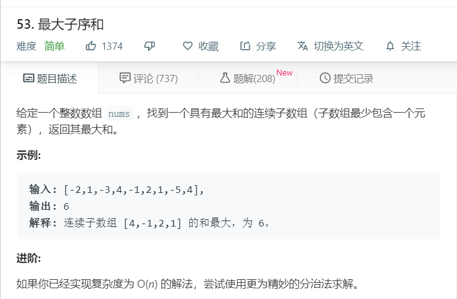

# 53.最大子序和
  

```
/**
 * @param {number[]} nums
 * @return {number}
 */
var maxSubArray = function(nums) {
    let te = nums.slice(0);
    te.sort((a,b)=>a-b);
    if(te[te.length-1] <=0){
        return te[te.length-1];
    }
    let temp = [],max=[];
    for(let i=0;i<nums.length;i++){
      if(temp.length == 0 && nums[i] >= 0){
        temp.push(nums[i]);
        max.push(temp[0]);
      }else{
        let num = temp[0]+nums[i];
        if(num>0){
          temp[0] = num;
          max.push(temp[0]);
        }else{
          temp.pop();
        }
      }
    }

    // console.log(Math.max(...max));
    return Math.max(...max);
};
```

```
/**
 * @param {number[]} nums
 * @return {number}
 */
var maxSubArray = function(nums) {
    let max = -Infinity;
    for (let i=0;i<nums.length;i++) {
        let nownum = nums[i];
        if (nownum > max) {
            max = nownum;
        }
        for (let j = i+1;j<nums.length;j++) {
            nownum += nums[j];
            if (nownum > max) {
                max = nownum;
            }
        }
    }

    console.log(max)
    return max === -Infinity ? 0 : max
};
```
```
var maxSubArray = function(nums){
    let ans = nums[0];
    let sum = 0;
    for(const num of nums){
        if(sum > 0){
            sum += num;
        }else{
            sum = num;
        }
        ans = Math.max(ans,sum);
    }
    return ans;
}
```