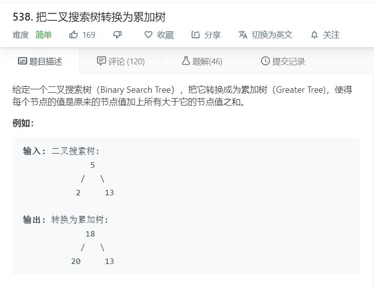

# 538.把二叉搜索树转换为累加树
  

```
/**
 * Definition for a binary tree node.
 * function TreeNode(val) {
 *     this.val = val;
 *     this.left = this.right = null;
 * }
 */
/**
 * @param {TreeNode} root
 * @return {TreeNode}
 */
var convertBST = function(root) {
    let temp = [],result = [];
    function mid(r){
        if(r){
            mid(r.left);
            temp.push(r.val);
            mid(r.right);
        }
    }
    mid(root);

    console.log(temp);
    function midtwo(r){
        if(r){
            midtwo(r.left);
            if(temp.indexOf(r.val)>=0){
               for(let i=temp.indexOf(r.val)+1;i<temp.length;i++){
                   r.val += temp[i];
               }
               result.push(r.val); 
            }
            midtwo(r.right);
        }
    }
    midtwo(root);

    return root;
};
```