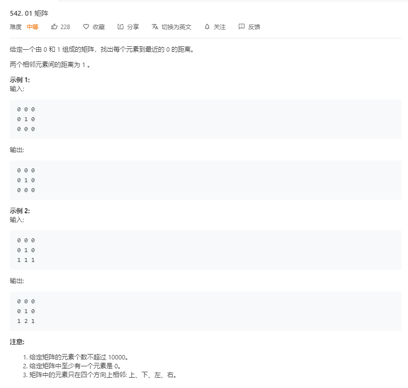

# 542.01矩阵
  

```
/**
 * @param {number[][]} matrix
 * @return {number[][]}
 */
var updateMatrix = function(matrix) {
    let m = matrix.length, n = matrix[0].length;
    let temp = [];
    for(let i=0;i<m;i++){
        for(let j=0;j<n;j++){
            if(matrix[i][j] == 0){
                temp.push([i,j]);
            }else{
                matrix[i][j] = -1;
            }
        }
    }

    let mate = [[1,0],[-1,0],[0,1],[0,-1]];
    while(temp.length > 0){
        let now = temp.pop();
        let nowx = now[0],nowy = now[1];
        for(let i=0;i<mate.length;i++){
            if(nowx + mate[i][0] < m && nowx + mate[i][0] > -1 
                && nowy + mate[i][1] < n && nowy + mate[i][1] > -1
                && matrix[nowx + mate[i][0]][nowy + mate[i][1]] == -1){
                    matrix[nowx + mate[i][0]][nowy + mate[i][1]] = matrix[nowx][nowy] + 1;
                    temp.unshift([nowx + mate[i][0],nowy + mate[i][1]]);
                }
        }
    }

    return matrix;
};
```