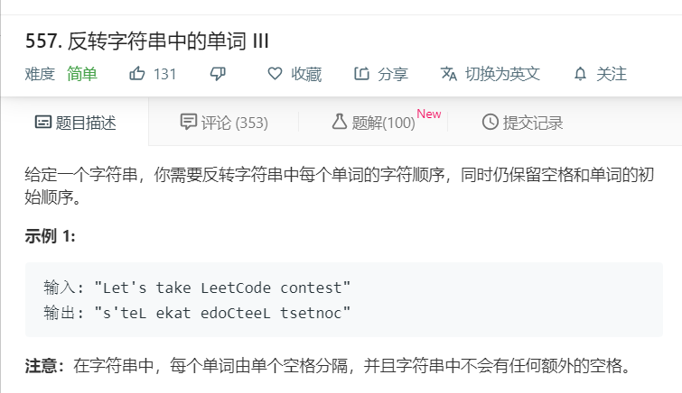

# 557.反转字符串中的单词III
  

```
/**
 * @param {string} s
 * @return {string}
 */
var reverseWords = function(s) {
  let temp = s.split(' ');
  let result = [];
  temp.forEach(function(ele){
      result.push(ele.split('').reverse().join(''));
  })
  return result.join(' ');
};

```