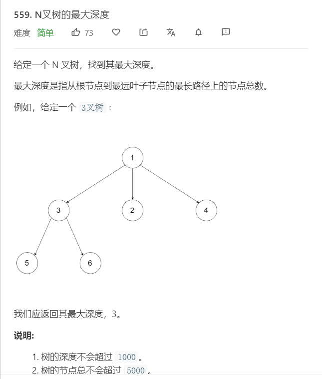

# 559.N叉树的最大深度
  

```
/**
 * // Definition for a Node.
 * function Node(val,children) {
 *    this.val = val;
 *    this.children = children;
 * };
 */
/**
 * @param {Node} root
 * @return {number}
 */
var maxDepth = function(root) {
    if(!root){
        return 0;
    }

    let temp = [root],result = [];

    while(temp.length){
        let one = [],two = [];
        while(temp.length){
            let now = temp.shift();
            one.push(now.val);

            if(now.children){
                now.children.forEach((el)=>{
                    two.push(el);
                })
            }
        }
        result.push(one);
        temp = two;
    }

    console.log(result)
    return result.length;
};
```