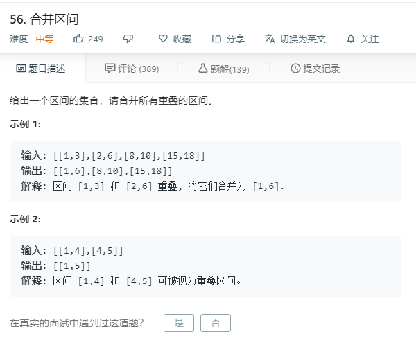

# 56.合并区间
  
```
/**
 * @param {number[][]} intervals
 * @return {number[][]}
 */
var merge = function(intervals) {
    if(intervals.length == 0){
        return intervals;
    }
    for(let i=0;i<intervals.length-1;i++){
        for(let j=i+1;j<intervals.length;j++){
            if(intervals[i][0]>intervals[j][0]){
                [intervals[i],intervals[j]] = [intervals[j],intervals[i]];
            }
        }
    }
    let result = [];
    for(let i=0;i<intervals.length-1;i++){
        if(intervals[i][0] >= intervals[i+1][0] && intervals[i][1] <= intervals[i+1][1]){
            intervals.splice(i,1);
            i--;
        }
        else if(intervals[i][0] <= intervals[i+1][0] && intervals[i][1] >= intervals[i+1][1]){
            intervals.splice(i+1,1);
            i--;
        }
        else if(intervals[i][1] >= intervals[i+1][0] && intervals[i][1] < intervals[i+1][1]){
            let temp = [intervals[i][0],intervals[i+1][1]];
            intervals[i+1] = temp;
            intervals.splice(i,1);
            i--;
        }
        
        else if(intervals[i][0] == intervals[i+1][1]){
            let temp = [intervals[i+1][0],intervals[i][1]];
            intervals[i+1] = temp;
            intervals.splice(i,1);
            i--;
        }
        else if(intervals[i][0] >= intervals[i+1][0] && intervals[i][0] <= intervals[i+1][1] && intervals[i][1] >= intervals[i+1][1]){
            let temp = [intervals[i+1][0],intervals[i][1]];
            intervals[i+1] = temp;
            intervals.splice(i,1);
            i--;
        }

    }
    return intervals;
};
```

## 排序后比较
```
/**
 * @param {number[][]} intervals
 * @return {number[][]}
 */
var merge = function(intervals) {
    intervals.sort((a,b)=>a[0]-b[0]);

    let result = [];

    for(let i = 0;i<intervals.length;i++){
        if(result.length == 0 || intervals[i][0] > result[result.length-1][1]){
            result.push(intervals[i]);
        }else{
            result[result.length-1][1] = Math.max(result[result.length-1][1],intervals[i][1]);
        }
    }

    return result;
};
```