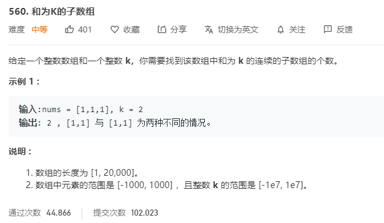
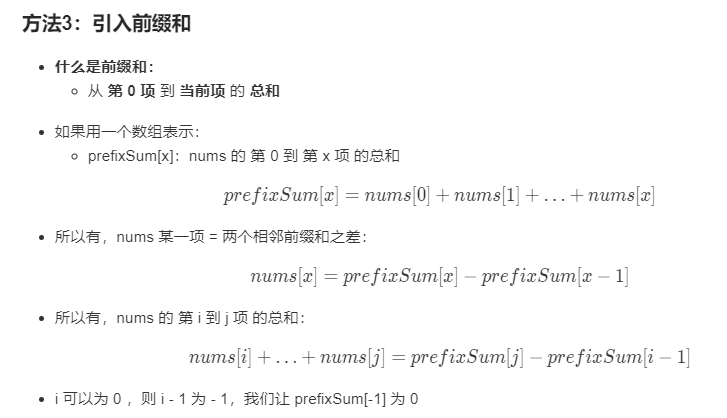
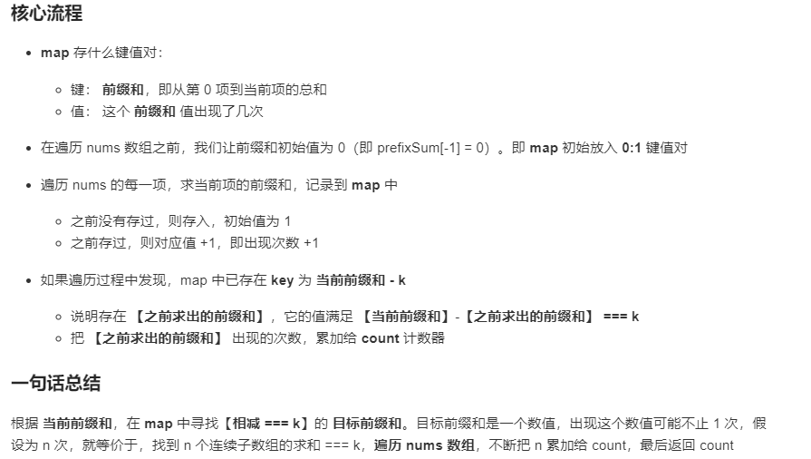

# 560.和为K的子数组
    

  

  

```
/**
 * @param {number[]} nums
 * @param {number} k
 * @return {number}
 */
var subarraySum = function(nums, k) {
    if(nums.length == 0) {
        return 0;
    }

    let count = 0,mate = {0:1},num = 0;

    for(let i=0;i<nums.length;i++) {
        num += nums[i];

        if(mate[num - k]) {
            count += mate[num-k];
        }
        if(mate[num]) {
            mate[num]++;
        }else {
            mate[num] = 1;
        }
    }

    return count;
};
```

