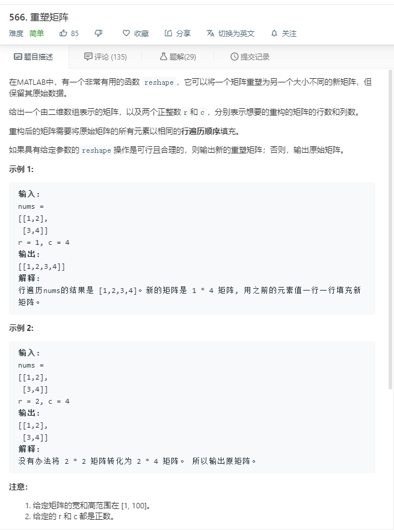

# 566.重塑矩阵
  

```
/**
 * @param {number[][]} nums
 * @param {number} r
 * @param {number} c
 * @return {number[][]}
 */
var matrixReshape = function(nums, r, c) {
    let temp = [],result=[];
    for(let i=0;i<nums.length;i++){
        for(let j=0;j<nums[i].length;j++){
            temp.push(nums[i][j]);
        }
    }

    if(r*c > temp.length){
        return nums;
    }
    for(let i=0;i<r;i++){
        let now = [];
        for(let j=0;j<c;j++){
            now.push(temp.shift());
        }
        result.push(now);
    }

    return result;

};
```