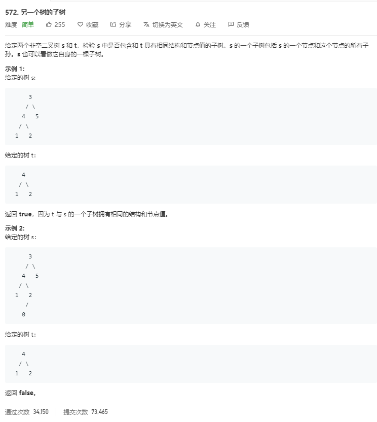

# 572.另一个树的子树
  

```
/**
 * Definition for a binary tree node.
 * function TreeNode(val) {
 *     this.val = val;
 *     this.left = this.right = null;
 * }
 */
/**
 * @param {TreeNode} s
 * @param {TreeNode} t
 * @return {boolean}
 */
var isSubtree = function(s, t) {
    if(!t) {
        return true;
    }

    if(!s) {
        return false;
    }

    return isSubtree(s.left,t) || isSubtree(s.right,t) || mid(s,t);
};

const mid = (s,t) => {
    if(!s && !t) {
        return true;
    }

    if(!s || !t || s.val != t.val) {
        return false;
    }
    return mid(s.left,t.left) && mid(s.right,t.right);
}
```