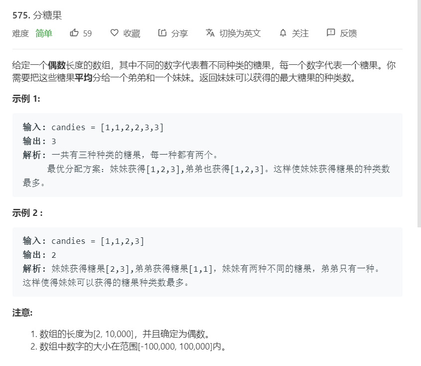

# 575.分糖果
  

```
/**
 * @param {number[]} candies
 * @return {number}
 */
var distributeCandies = function(candies) {
    let one = [];
    for(let i=0;i<candies.length;i++){
        if(one.indexOf(candies[i]) < 0){
            one.push(candies[i]);
        }
    }

    let mid = candies.length >> 1;
    if(one.length >= mid){
        return mid;
    }else{
        return one.length;
    }
};
```