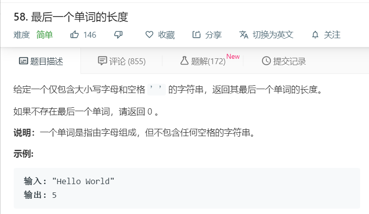

# 58.最后一个单词的长度
  

```
/**
 * @param {string} s
 * @return {number}
 */
/**
 * @param {string} s
 * @return {number}
 */
var lengthOfLastWord = function(s) {
  if(s == ""){
    return 0;
  }
  if(s.trim().length == 0){
    return 0;
  }
  let temp = s.trimEnd().split(' ');
  return temp[temp.length-1].length;
};
```