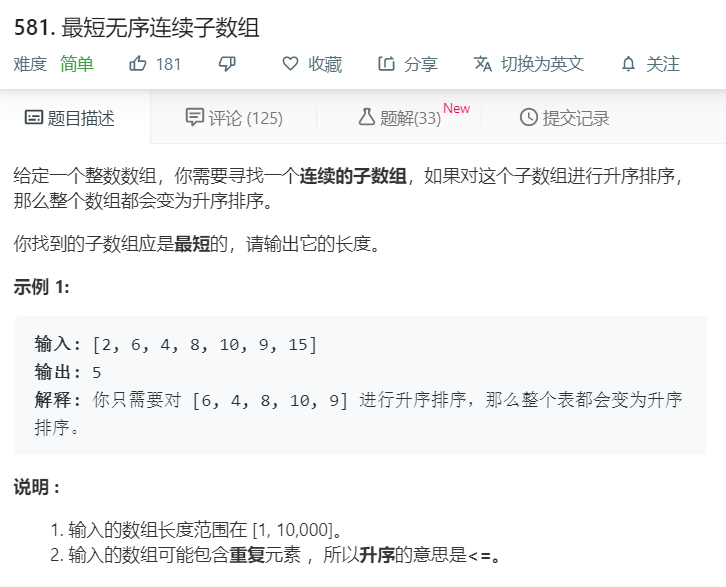

# 581.最短无序连续子数组
  

```
/**
 * @param {number[]} nums
 * @return {number}
 */
var findUnsortedSubarray = function(nums) {
    let tempstr = nums.slice(0);
    let numtwo = nums.sort((a,b)=> a - b);
    let start=0,end=0;
    for(let i=0;i<nums.length;i++){
        if(tempstr[i] != numtwo[i]){
            start = i;
            break;
        }
    }
    for(let i=nums.length-1;i>=0;i--){
        if(tempstr[i] != numtwo[i]){
            end = i;
            break;
        }
    }

    // console.log(start,end);
    if(start == end){
        return 0;
    }
    return end - start + 1;
};
```