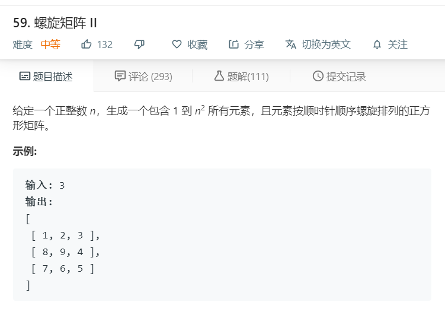

# 59.螺旋矩阵II
  

```
/**
 * @param {number} n
 * @return {number[][]}
 */
var generateMatrix = function(n) {
    let u = 0,d = n-1, l = 0, r = n-1;
    let result = [];
    let one = 1;

    for(let i=0;i<n;i++){
        result.push([]);
    }

    while(true){
        for(let i=l;i<=r;i++){
            result[u][i] = one;
            one++;
        }
        if(++u > d)break;

        for(let i=u;i<=d;i++){
            result[i][r] = one;
            one++;
        }
        if(--r < l)break;

        for(let i=r;i>=l;i--){
            result[d][i] = one;
            one++;
        }
        if(--d < u)break;

        for(let i=d;i>=u;i--){
            result[i][l] = one;
            one++;
        }
        if(++l > r)break;
    }

    return result;
};
```