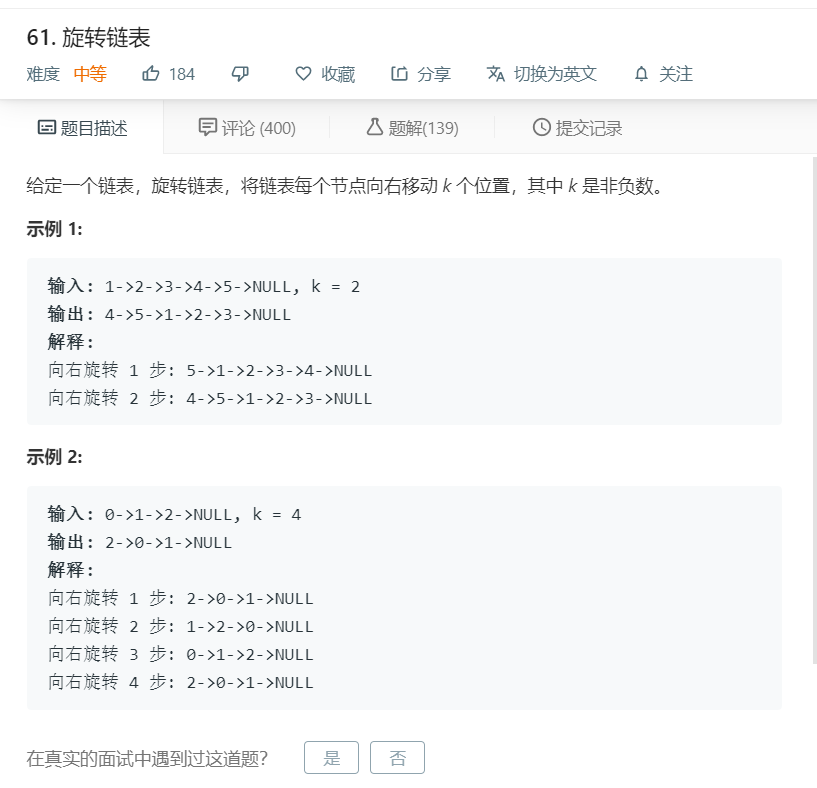

# 61.旋转链表
  

```
/**
 * Definition for singly-linked list.
 * function ListNode(val) {
 *     this.val = val;
 *     this.next = null;
 * }
 */
/**
 * @param {ListNode} head
 * @param {number} k
 * @return {ListNode}
 */
var rotateRight = function(head, k) {
    let temp = [],num = 0;
    while(head){
        temp.push(head);
        head = head.next;
        num += 1;
    }
    k = k%num;
    console.log(k,num)
    if(temp.length == 0){
        return null;
    }
    for(let i=0;i<k;i++){
        temp.unshift(temp.pop());
    }

    console.log(temp);

    for(let i=0;i<temp.length-1;i++){
        temp[i].next = temp[i+1];
    }

    temp[temp.length-1].next = null;

    return temp[0];
};
```