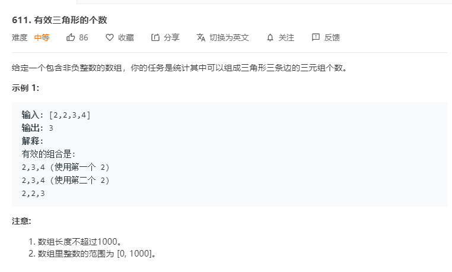

# 611.有效三角形的个数
  

```
/**
 * @param {number[]} nums
 * @return {number}
 */
var triangleNumber = function(nums) {
    let num = 0;
    nums.sort((a,b)=>a-b);

    let mid = (temp) => {
        if(temp.length == 3) {
            if(nums[temp[0]] + nums[temp[1]] > nums[temp[2]]) {
                num++;
            }
            return ;
        }

        if(temp.length == 0) {
            for(let i = 0;i < nums.length;i++) {
                if(temp.indexOf(i) < 0 && i > Math.max(...temp)) {
                    temp.push(i);
                    mid(temp);
                    temp.pop();
                }
            }
        }else {
            for(let i = Math.max(...temp) + 1;i < nums.length;i++) {
                temp.push(i);
                mid(temp);
                temp.pop();
            }
        }
    }

    mid([]);

    return num;
};
```