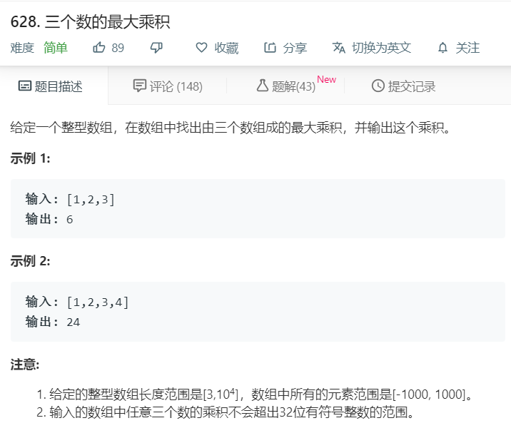

# 628.三个数的最大乘积
  

```
/**
 * @param {number[]} nums
 * @return {number}
 */
var maximumProduct = function(nums) {
    nums.sort((a,b)=>a-b);
    let temp = 1;
    if(nums.length === 3){
        nums.forEach((ele,index)=>{
            temp *= nums[index];
        })
        return temp;
    }else{
        let one = nums[0]*nums[1]*nums[nums.length-1];
        let two = nums[nums.length-1]*nums[nums.length-2]*nums[nums.length-3];
        return Math.max(one,two);
    }
};
```