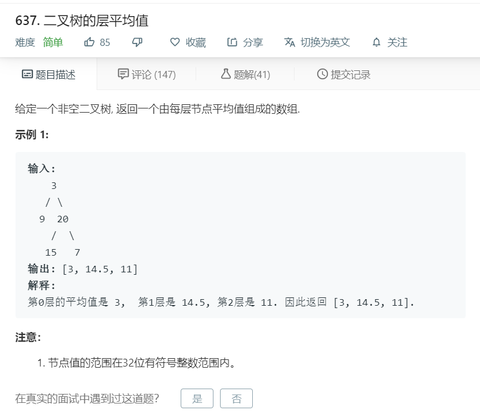

# 637.二叉树的层平均值
  

```
/**
 * Definition for a binary tree node.
 * function TreeNode(val) {
 *     this.val = val;
 *     this.left = this.right = null;
 * }
 */
/**
 * @param {TreeNode} root
 * @return {number[]}
 */
var averageOfLevels = function(root) {
    let temp = [];
    function mid(r,he){
        if(!r){
            return;
        }

        if(temp[he]){
            temp[he].push(r.val);
        }else{
            temp[he] = [r.val];
        }

        mid(r.left,he+1);
        mid(r.right,he+1);
    }

    mid(root,0);
    temp.forEach((el,index)=>{
        let now = 0;
        el.forEach((ele)=>{
            now += ele;
        });
        temp[index] = now/el.length;
    })

    console.log(temp)
    return temp;
};
```